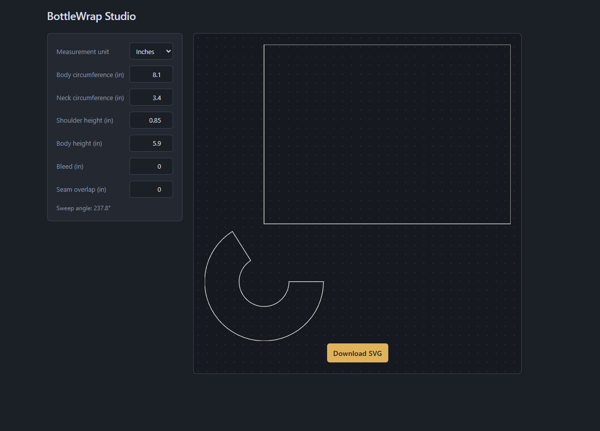

# BottleWrap Studio

[](https://github.com/Lens2199/bottlewrap-studio/actions/workflows/ci.yml)

BottleWrap Studio was created to solve a practical problem: guessing bottle-wrap templates in design software wastes paper and produces inaccurate labels.

The app converts real bottle measurements into a printable SVG template. It supports cylindrical and tapered bottles, displays the result in a live preview, and includes bleed and seam overlap for printing and installation.

## Live Demo

[Open BottleWrap Studio](https://bottlewrap-studio.vercel.app)

## Screenshot



## Features

- Generates body and shoulder templates from real measurements
- Supports cylindrical and tapered bottles
- Adds print bleed and a constant-width seam tab
- Displays an interactive SVG preview
- Exports a correctly sized SVG for printing

## Geometry

A tapered bottle shoulder becomes part of a cone when extended toward an imaginary apex. The app uses similar triangles to calculate the cone’s inner and outer radii, then calculates the sweep angle needed for the shoulder band to match the bottle circumference.

The shoulder outline combines an outer arc, a reversed inner arc, and two straight edges. Bleed expands both radii and the straight edges, while seam overlap extends one edge using a perpendicular unit vector.

## What I Learned

An early version produced a sweep angle greater than 360 degrees. That bug helped me realize that the tapered shoulder could not be calculated as a flat ring—the missing part was the cone’s imaginary apex.

I also learned how to build SVG polygons in the correct point order, use perpendicular vectors for constant-width padding, and separate geometry calculations from rendering logic.

Finally, I added automated tests and a GitHub Actions workflow so every push and pull request runs the test suite and verifies the production build.

## Tech Stack

- React
- TypeScript
- Vite
- SVG
- Vitest
- GitHub Actions
- Vercel

## Run Locally

Clone the repository:

```bash
git clone https://github.com/Lens2199/bottlewrap-studio.git
cd bottlewrap-studio