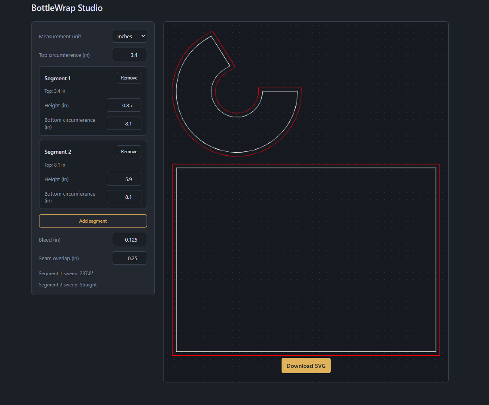

# BottleWrap Studio

[](https://github.com/Lens2199/bottlewrap-studio/actions/workflows/ci.yml)

BottleWrap Studio solves a practical problem: guessing wrap templates in design software wastes material and produces inaccurate labels.

The app converts real container measurements into printable SVG templates. It supports straight and tapered containers built from any number of stacked sections, with print bleed and seam overlap.

## Live Demo

[Open BottleWrap Studio](https://bottlewrap-studio.vercel.app)

## Screenshot



## Features

- Builds wrap templates from real circumference and height measurements
- Supports straight, gently tapered, and sharply tapered sections
- Allows users to add or remove any number of stacked segments
- Automatically shares circumference boundaries between connected segments
- Supports inches and centimeters
- Adds a constant-width seam tab to the final cut shape
- Displays separate red bleed lines and cut lines
- Groups bleed and cut paths separately in exported SVG files
- Displays a live SVG preview
- Exports a correctly sized SVG for printing
- Validates empty, invalid, and impossible measurements
- Runs automated tests and a production build through GitHub Actions

## How It Works

A container is represented as a stack of segments. Each segment has:

- A top circumference
- A bottom circumference
- A height

The bottom circumference of one segment automatically becomes the top circumference of the next segment. This prevents users from entering connected sections that do not match.

A container with `N` segments requires only `2N + 1` measurements:

- `N + 1` shared circumference boundaries
- `N` segment heights

For example, a container with three sections needs four circumference measurements and three height measurements.

## Geometry

When a segment has equal top and bottom circumferences, its printable template is a rectangle.

When the circumferences differ, the segment is a conical frustum. Extending that frustum toward an imaginary apex forms a complete cone. BottleWrap Studio uses similar triangles to calculate the inner radius, outer radius, and sweep angle of the flattened curved band.

The calculation normalizes the larger and smaller circumferences, so it works whether the container is wider at the top or at the bottom.

Each tapered outline combines:

- An outer arc
- A reversed inner arc
- Two straight connecting edges

Reversing the inner arc keeps the polygon points in perimeter order and prevents the finished polygon from crossing itself.

## Cut Lines, Bleed, and Seam Overlap

The exported template keeps the physical cut line separate from the bleed line.

The seam overlap is included in the cut shape because that material remains on the finished label and is used to join the wrap.

The red bleed outline extends beyond the complete cut shape, including the seam tab. This shows how far the printed artwork should extend so trimming does not leave an unprinted edge.

When bleed is zero, BottleWrap Studio does not create an unnecessary bleed polygon.

The exported SVG organizes the outlines into named groups:

```xml
<g id="bleed">
  <!-- Red bleed outlines -->
</g>

<g id="cut">
  <!-- Black cut outlines -->
</g>
```

These groups make it easier to select all bleed or cut paths in design software such as Adobe Illustrator.

## Using the App

1. Select inches or centimeters.
2. Enter the circumference at the top of the container.
3. Enter the height and bottom circumference of the first segment.
4. Add another segment wherever the container changes shape.
5. Enter the height and bottom circumference of each additional segment.
6. Enter optional bleed and seam-overlap values.
7. Review the generated pieces in the live preview.
8. Download the correctly sized SVG.

For a multi-section container, measure the circumference at every point where its shape changes. Then measure the vertical distance between each pair of circumference measurements.

## What I Learned

An early version produced a sweep angle greater than 360 degrees. That bug helped me realize that a tapered section could not be treated as a flat ring—the missing part was the cone’s imaginary apex.

I learned how to generate SVG polygons in the correct point order, reverse an inner arc to prevent a bowtie, and use perpendicular vectors to create constant-width padding and seam tabs.

The project was later generalized from a fixed body-and-shoulder model into an array of reusable wrap segments. This introduced React concepts including:

- Immutable array updates with `map`, spread, and `filter`
- Stable React keys using `crypto.randomUUID()`
- Functional state setters that prevent stale-state bugs
- Lazy `useState` initialization
- Conditional rendering
- TypeScript utility types such as `Partial` and `Omit`

I also learned how to model shared boundaries so invalid combinations are impossible to enter. Instead of validating duplicate measurements afterward, the app stores each shared circumference once and derives the connected segments from it.

The geometry, outline generation, padding, layout, and SVG export logic are separated into independently tested functions. GitHub Actions runs the automated tests and verifies the production build on every push and pull request.

## Tech Stack

- React
- TypeScript
- Vite
- SVG
- Vitest
- GitHub Actions
- Vercel

## Run Locally

Clone the repository:

```bash
git clone https://github.com/Lens2199/bottlewrap-studio.git
cd bottlewrap-studio
```

Install dependencies:

```bash
npm install
```

Start the development server:

```bash
npm run dev
```

Run the tests once:

```bash
npm test -- --run
```

Create a production build:

```bash
npm run build
```

## Testing

The test suite covers:

- Straight and tapered segment geometry
- Segments that are wider at the top
- Arc-length verification
- Arc-point generation
- Rectangle and curved-band outlines
- Bleed and seam-tab geometry
- Separate cut and bleed outlines
- Multi-piece layout
- Inch and centimeter SVG export
- Named bleed and cut SVG groups

Run the tests with:

```bash
npm test -- --run
```

## Deployment

The app is deployed with Vercel. Every push to `main` triggers a new deployment.

GitHub Actions runs the test suite and production build on pushes and pull requests to `main`.

## Planned Improvements

- Saved presets for commonly used bottles and tumblers
- A verified Stanley Quencher 40 oz preset
- Optional rotation controls for arranging exported pieces
- Additional print-layout controls